# UTC Dataset
## Prediction of Credit Card Default in Taiwan

This UTC data set deals with the case of customers default payments in Taiwan.
My model try to predict  the probability of default with three different machine learning methods.  More details about the data set and the UTC research  can be found in the UTC website - https://archive.ics.uci.edu/ml/datasets/default+of+credit+card+clients#

Following is the Attribute information: 

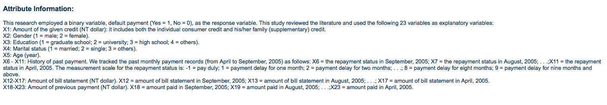

I started my work with a basic EDA of the Data:

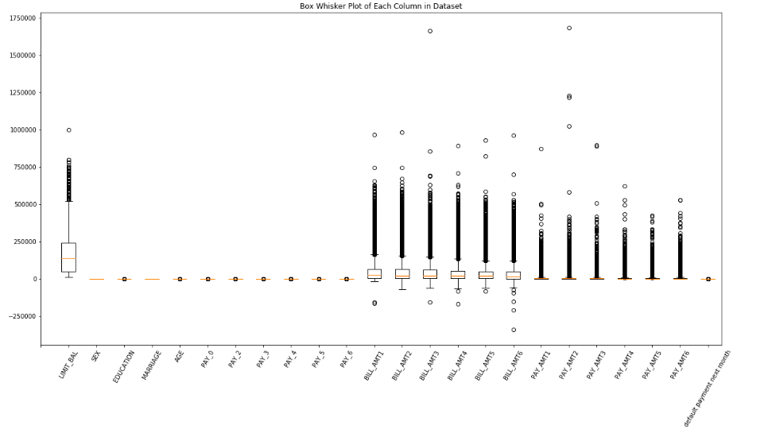

Following the preliminary EDA I decided to drop outliers and the sizes of the bills (who did not show any correlation with the risk of default)

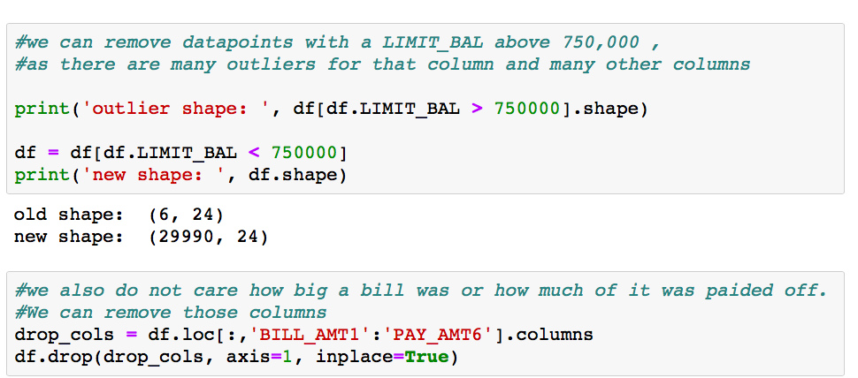

I also decided to merge the payment time to three groups: on time, one month delay and more than one month delay.

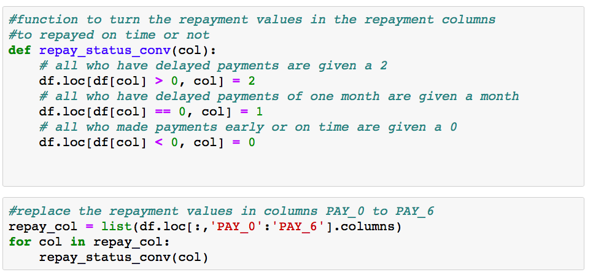

After applying the changes, this is how curently the top five elements in my dataset look like:

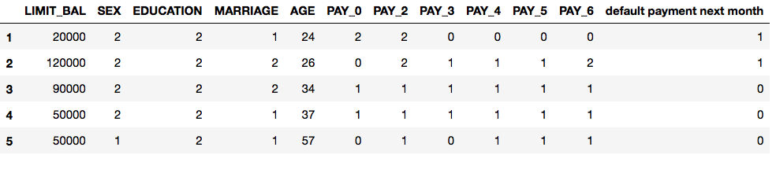

I also checked an histogram of the data to get better idea about the distebutions of the differnce features

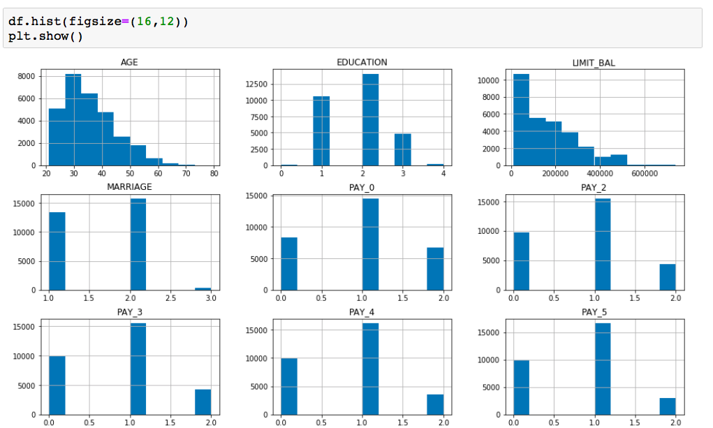

And the distribution and the size of credit among different variables

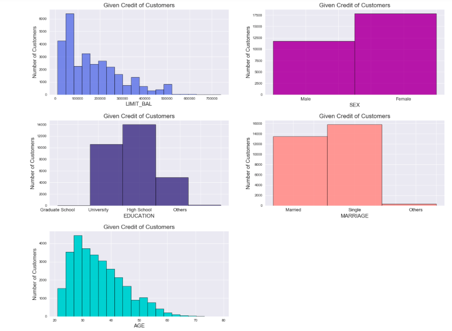

I also checked the default status among different groups. my conclution wre written under the chart:

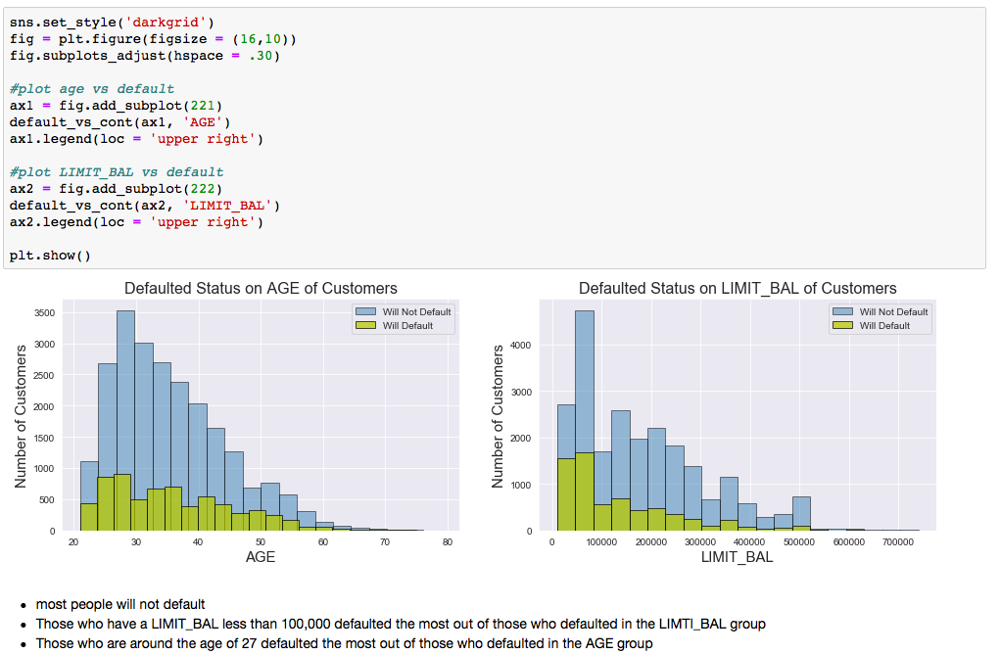

I found out that there is some correlation between delay in paymnts to default in the next months

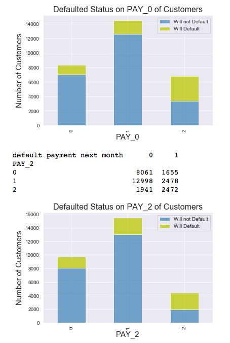

dropping variables

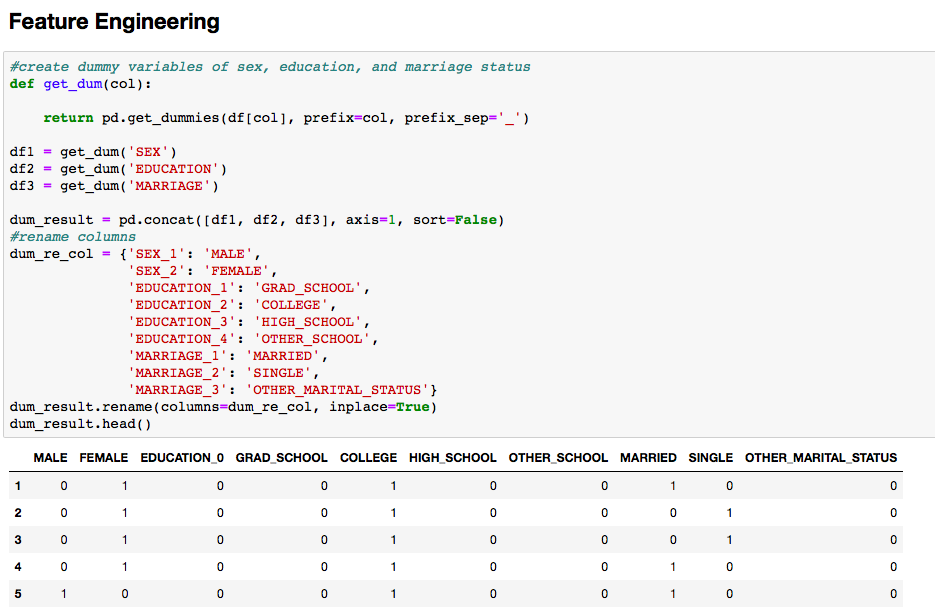

dummy variables, renaming

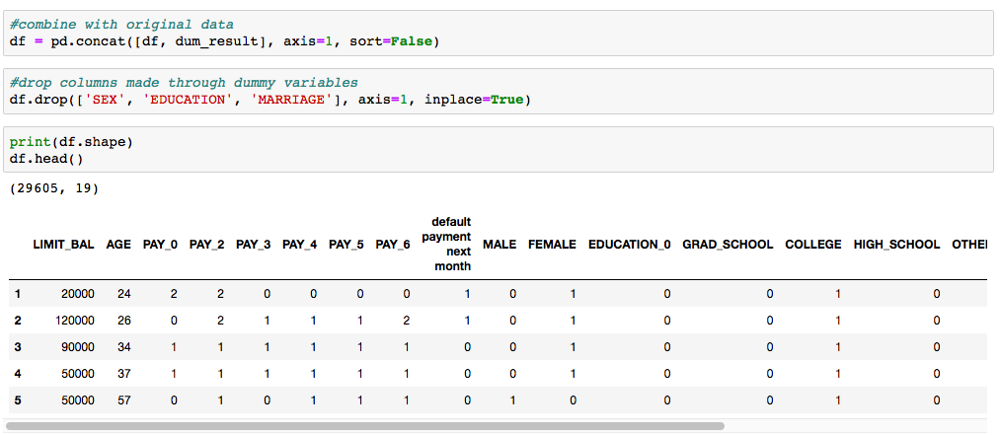

While there are no clear fetures that influenct clearly the risk of defalut i decided to create more features with polinomials and interaction 

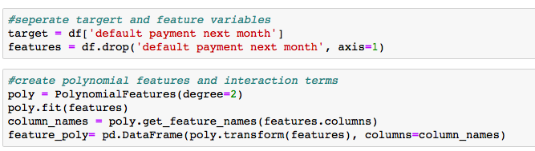

Train test split

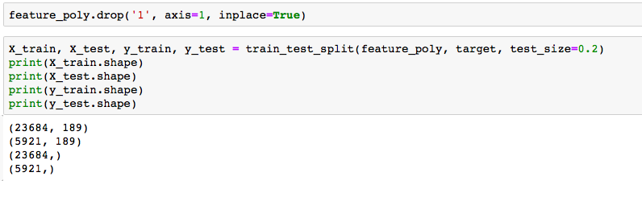

Feature selection

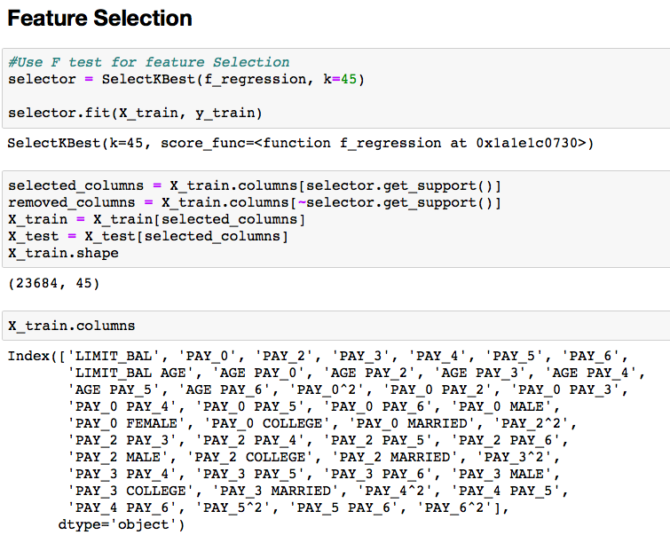

scaling

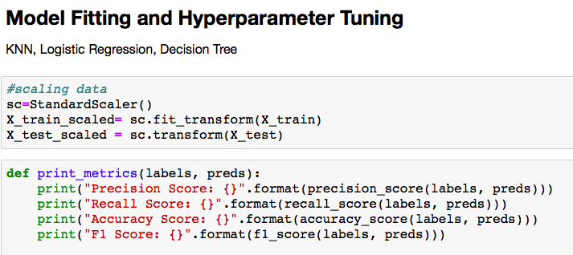

after basic models, hyper parameter tunning

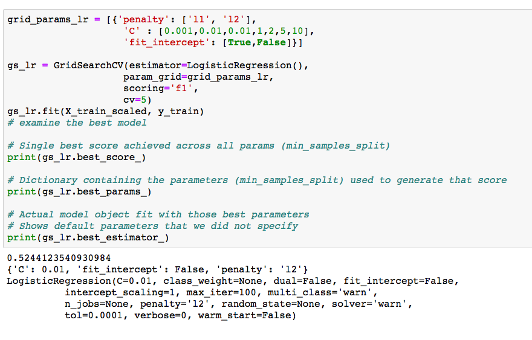

evaluation

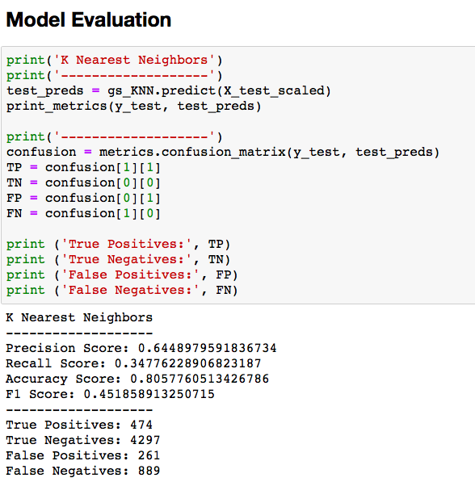

evaluation

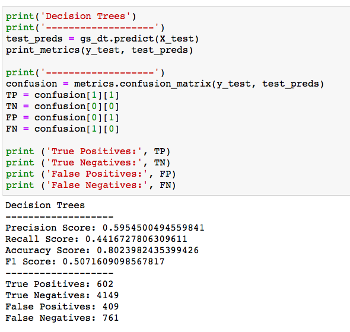

final model

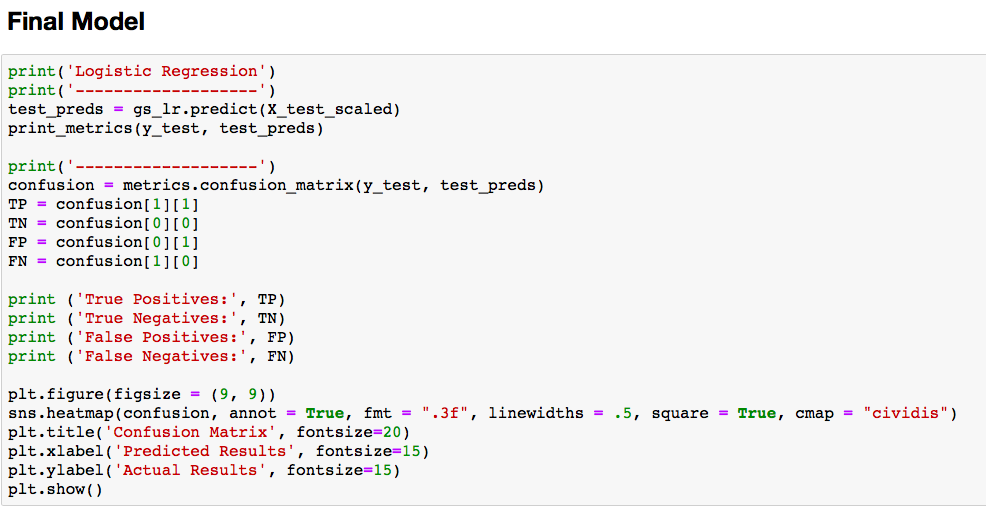

confusion matrix

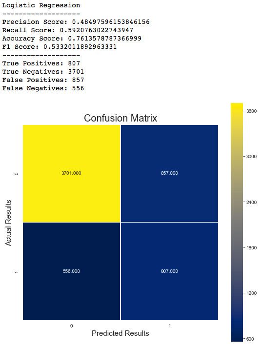

summary

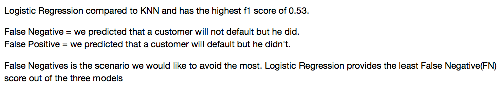
