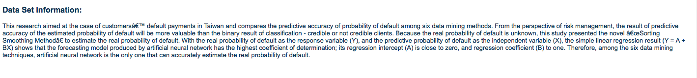

# UTC dataset
## Prediction of Credit Card Default

This UTC data set deals with the case of customers default payments in Taiwan.
My model try to predict  the probability of default with three different machine learning methods.  More details about the data set and the research regading it can be fount in the UTC website - https://archive.ics.uci.edu/ml/datasets/default+of+credit+card+clients#

Following is the Attribute information: 

A

A

A

A

A

A

A

A

A

A

A

A

A

A

A

A

A

A

A

A

A

A

